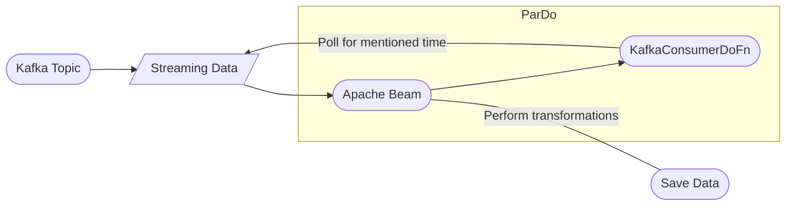

# Steps to reproduce the workflow for consumer-to-beam.py

**I am using confluent kafka locally 

## Step 1: 

- Start zookeeper server, kafka server, docker daemon for apache beam 

## Step 2 Create a kafka topic: 
bin/kafka-topics --create --topic topic-name --bootstrap-server <host ip>:9092 --partitions 1

## Step 3: 
  
Add the Kafka topic to a consumer group: 

./bin/kafka-consumer-groups --bootstrap-server <host ip>:9092  --group <group-name> --topic <topic-name> --reset-offsets --to-earliest -–execute 
  
## Step 4:
  
Write some messages to the topic using a kafka console producer: 
  
bin/kafka-console-producer --topic please-work --from-beginning --bootstrap-server  172.25.157.44:9092 

**Do not exit this command since we are trying to simulate streaming data
  
Check if you can read them using: 

bin/kafka-console-consumer --topic <topic-name> --from-beginning --bootstrap-server  <host ip>:9092 
  
## Step 5:
  
copy, update the kafka topic configuration and run the consumer-to-beam.py file

As it runs, write some new messages from the kafka producer (the polling time for consumer is 60 seconds)
  
Check if it worked by looking for output.txt and if your messages are reflected in it.
